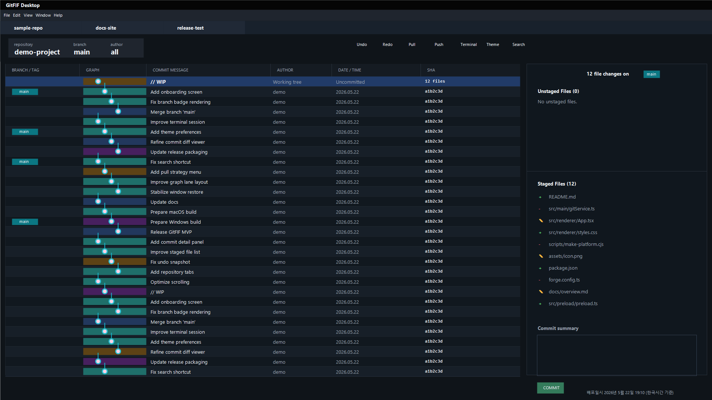

# GitFIF

GitFIF 실행 파일 다운로드 전용 저장소입니다.

GitFIF Desktop은 커밋 그래프, 브랜치/태그 표시, 변경 파일 stage/unstage, diff 확인, 검색, 테마 설정을 한 화면에서 다룰 수 있는 Electron 기반 데스크톱 Git 클라이언트입니다.
이 저장소에서는 Windows와 macOS에서 바로 실행할 수 있는 배포 파일만 제공합니다.

## 다운로드

| OS | 파일 |
| --- | --- |
| Windows x64 설치 파일 | [GitFIF-Windows.exe](downloads/GitFIF-Windows.exe) |
| Windows x64 압축 실행판 | [GitFIF-Windows-x64.zip](downloads/GitFIF-Windows-x64.zip) |
| macOS Apple Silicon | [GitFIF-macOS.dmg](downloads/GitFIF-macOS.dmg) |

## 사용 방법

### Windows

1. 설치 파일을 사용할 경우 `GitFIF-Windows.exe`를 다운로드해 실행합니다.
2. 압축 실행판을 사용할 경우 `GitFIF-Windows-x64.zip`을 다운로드합니다.
3. 압축을 해제한 뒤 폴더 안의 `GitFIF.exe`를 실행합니다.

### macOS

1. `GitFIF-macOS.dmg`를 다운로드합니다.
2. DMG 파일을 엽니다.
3. `GitFIF.app`을 실행하거나 Applications 폴더로 옮겨 사용합니다.

## 무결성 확인

다운로드 파일의 SHA-256 해시는 [SHA256SUMS.txt](SHA256SUMS.txt)에서 확인할 수 있습니다.
